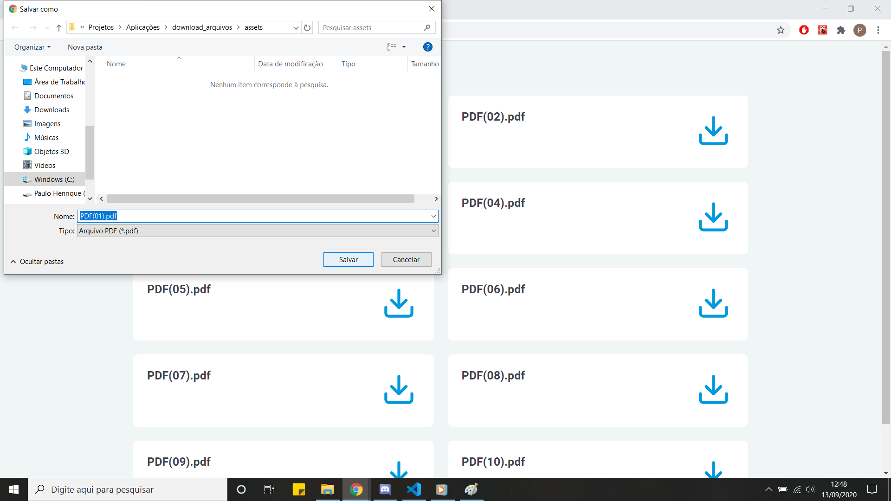

# DOWNLOAD DE ARQUIVOS EM PASTA LOCAL UTILIZANDO O FILE SYSTEM
Pequeno projeto para demonstrar download de arquivos PDF em pasta local.

<h2 align="center"> Desenvolvida com as tecnologias  JavaScript, 
 Node, 
 React.

<h3> Outras tecnologias: </h3>
<ul>
  <li> <a href="https://www.npmjs.com/package/nodemon/"> Nodemon </a> </li> 
  <li> <a href="https://expressjs.com/pt-br/"> Express </a> </li>
  <li> <a href="https://www.npmjs.com/package/axios"> Axios </a> </li>
  <li> <a href="https://www.npmjs.com/package/cors"> Cors </a> </li>
  <li> <a href="https://nodejs.org/api/fs.html"> File System </a> </li>
</ul>

<h3> Para utilizar: </h3>

 Faça o download do projeto no GitHub  
 Execute <code>npm install</code> ou <code>yarn install</code>  nas pastas <b>backend e web</b>, para instalar as dependências. 
 Execute <code>npm start</code> ou <code>yarn start</code> na pasta <b>back-end</b> para rodar o servidor na porta localhost:3333 
 Execute <code>npm start</code> ou <code>yarn start</code> na pasta <b>front-end</b> para rodar a página web na porta localhost:3000 

<h3> Interface WEB: </h3>
<table>
	<tr>
		<th width="100%">
			Listagem de arquivos 
		</th>
	</tr>
	<tr>
		<td>
			
		</td>
	</tr>
  	<tr>
		<th width="100%">
       Downloads 
		</th>
	</tr>
	<tr>
		<td>
			
		</td>
	</tr>
  	<tr>
		<th width="100%">
			Downloads 
		</th>
	</tr>
	<tr>
		<td>
			
		</td>
	</tr>
<table>

Para utilizar basta no arquivo downloadController.js especificar a pasta onde se encontra os documentos a serem listados para download na linha 6.
